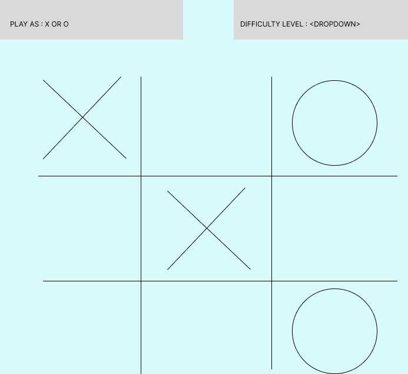

# Tic-Tac-Toe
Simple game to play tic-tac-toe either against your friend or an AI overlord 
- This is a single player game against AI
- You can choose to play in three levels against an AI - easy, medium or overlord
- Win 3 / 5 rounds to win the game

live url - https://tamermint.github.io/Tic-Tac-Toe/

- Doco :
 - newGame() - resets the state to initial conditions
 - restartGame() - maintains the state but clears the board
 - setupBoard() - uses restartGame() and calls playerChoice();
 - playerChoice() - listens for the mouse click and adds in either X or O
 - endRound() - increments the game rounds and checks whether the rounds have reached 5. If 
    gameRounds != 5, it calls setupBoard()
 - winConditions() - checks for the winning conditions
 - checkTie() - checks whether its a tie
 - aiChoice() - utilizes depth limited minimax algorithm and plays agains you
 - checkForRoundWinner() and checkTournamentWinner() - checks for round and tournament winner
 - gameController() - calls the setupBoard() and playerChoice();

 Note: If it's tie, click on restart game :D
